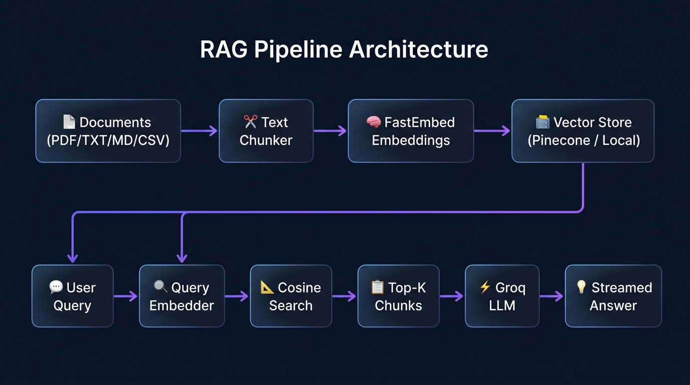

# 🧠 RAG Assistant — Intelligent Document AI

<p align="center">
  
</p>

<p align="center">
  
  
  
  
  
  
</p>

> A modern, high-performance **Retrieval-Augmented Generation (RAG)** chatbot. Upload your documents, ask questions, and get cited AI answers in real time — powered by **FastAPI**, **Groq LLM inference**, **FastEmbed** ONNX embeddings, and **Pinecone** vector storage with automatic local fallback.

---

## ✨ Key Features

| Feature | Description |
|---|---|
| ⚡ **Ultra-Fast Inference** | Groq LPU delivers real-time token streaming with near-zero latency |
| 🧬 **Local ONNX Embeddings** | FastEmbed `BAAI/bge-small-en-v1.5` — no PyTorch, no GPU required |
| 🗄️ **Dual Vector Store** | Pinecone Serverless cloud **or** persistent local cosine-similarity store |
| 📄 **Multi-Format Ingestion** | PDF, TXT, Markdown, CSV, and source code files |
| 🎨 **Glassmorphic UI** | Drag-and-drop upload, live streaming, markdown rendering, source citations |
| 🔁 **Auto Model Fallback** | Automatically switches LLM if the primary hits a rate limit or error |

---

## 🖥️ Screenshots

### Chat Interface
<p align="center">
  
</p>

### Document Chunks Explorer
<p align="center">
  
</p>

---

## 🏗️ Architecture

<p align="center">
  
</p>

The system works in two phases:

**📥 Ingestion Pipeline**
```
Documents (PDF / TXT / MD / CSV)
  → Text Chunker  (chunk_size=500, overlap=100)
  → FastEmbed BAAI/bge-small-en-v1.5  (384-dim ONNX vectors)
  → Pinecone Serverless  OR  Local Vector Store
```

**💬 Query Pipeline**
```
User Query
  → FastEmbed Query Vectorizer
  → Cosine Similarity Search  (Top-K=4 chunks)
  → Groq LLM Prompt Synthesis  (context + question)
  → Streamed SSE Answer + Source Citations  →  Web UI
```

---

## 🚀 Quick Start

### Prerequisites
- **Python 3.11+**
- **[uv](https://github.com/astral-sh/uv)** (recommended) or standard `pip`
- A free **[Groq API Key](https://console.groq.com)**

---

### Step 1 — Clone & Set Up Environment

```powershell
# Create virtual environment
uv venv

# Install all dependencies
uv sync

# Alternative: install from requirements.txt
uv pip install -r requirements.txt
```

---

### Step 2 — Configure Environment Variables

Copy `.env.example` to `.env` and fill in your credentials:

```env
PROJECT_NAME="RAG ChatBot Assistant"

# ── Groq LLM (Required) ─────────────────────────────────────────
# Get your free key at: https://console.groq.com
GROQ_API_KEY=your_groq_api_key_here
GROQ_MODEL=openai/gpt-oss-20b

# ── Pinecone Vector DB (Optional) ───────────────────────────────
# Leave blank to use the built-in local vector store automatically
PINECONE_API_KEY=your_pinecone_api_key_here
PINECONE_INDEX=rag-chatbot
PINECONE_ENVIRONMENT=us-east-1

# ── Embedding Model ──────────────────────────────────────────────
EMBEDDING_MODEL=BAAI/bge-small-en-v1.5

# ── Chunking & Retrieval ─────────────────────────────────────────
CHUNK_SIZE=500
CHUNK_OVERLAP=100
TOP_K=4
```

> **Tip:** If `PINECONE_API_KEY` is left blank, the app automatically falls back to a fully local vector store — no extra setup needed.

---

### Step 3 — Run the Application

**Option A — Using `uv` (recommended):**
```powershell
uv run run.py
# or
uv run start
```

**Option B — Using `uvicorn` directly:**
```powershell
cd Backend
uvicorn main:app --reload --host 127.0.0.1 --port 8000
```

---

### Step 4 — Open in Browser

| URL | Description |
|---|---|
| 🌐 [http://127.0.0.1:8000](http://127.0.0.1:8000) | Main Web Application |
| 📖 [http://127.0.0.1:8000/docs](http://127.0.0.1:8000/docs) | Swagger Interactive API Docs |
| `frontend/index.html` | Open directly in any browser (static mode) |

---

## 📡 API Reference

### 🔍 Health & Status

| Method | Endpoint | Description |
|---|---|---|
| `GET` | `/api/health` | Server status, Groq config, vector store mode |

### 📂 Document Management

| Method | Endpoint | Description |
|---|---|---|
| `POST` | `/api/documents/upload` | Upload a document (`multipart/form-data`) |
| `GET` | `/api/documents/` | List all indexed documents with metadata |
| `DELETE` | `/api/documents/{doc_id}` | Remove a document and its embeddings |
| `GET` | `/api/documents/stats` | Knowledge base stats and chunk counts |

### 💬 Chat & Generation

| Method | Endpoint | Description |
|---|---|---|
| `POST` | `/api/chat/` | Query the knowledge base, get a cited response |
| `POST` | `/api/chat/stream` | Real-time token streaming via Server-Sent Events (SSE) |

---

## 🧪 Running Tests

```powershell
.\.venv\Scripts\python.exe tests\test_rag.py
```

---

## 🐳 Docker Support

```powershell
docker-compose up --build
```

The app will be available at [http://localhost:8000](http://localhost:8000).

---

## 📁 Project Structure

```
chatbot/
├── Backend/
│   ├── app/
│   │   ├── api/            # FastAPI route handlers
│   │   ├── services/       # Groq, embedding & vector store services
│   │   └── config.py       # Settings & environment config
│   └── main.py             # FastAPI app entry point
├── frontend/
│   └── index.html          # Glassmorphic single-page web UI
├── images/                 # README screenshots & diagrams
├── tests/                  # RAG pipeline test suite
├── .env.example            # Environment variable template
├── run.py                  # Convenience startup script
├── docker-compose.yml      # Docker Compose configuration
└── README.md
```

---

## 🛠️ Tech Stack

| Layer | Technology |
|---|---|
| **Backend Framework** | [FastAPI](https://fastapi.tiangolo.com/) |
| **LLM Inference** | [Groq](https://groq.com/) (`openai/gpt-oss-20b` + auto-fallback chain) |
| **Embeddings** | [FastEmbed](https://github.com/qdrant/fastembed) — `BAAI/bge-small-en-v1.5` |
| **Vector Store** | [Pinecone Serverless](https://www.pinecone.io/) / Local cosine similarity |
| **Document Parsing** | `pypdf`, built-in text parsers |
| **Streaming** | Server-Sent Events (SSE) |
| **Package Manager** | [uv](https://github.com/astral-sh/uv) |
| **Frontend** | Vanilla HTML / CSS / JS — Glassmorphism dark UI |

---

## 📄 License

This project is licensed under the **MIT License**.
